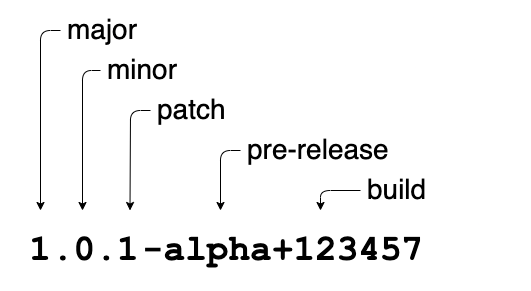

# Bijlage 1: Versionering van de documenten

Deze bijlage beschrijft de versioneringsmethodiek ofwel de standaard manier om om te gaan met versienummers van VERA. VERA heeft een voorspelbare release cyclus. Wij streven naar een balans tussen het regelmatig uitbrengen van voorspelbare versies en het vermijden van een overdaad aan versies op de markt.

Semantic Versioning
We sluiten net als OpenApi aan bij Semantic Versioning 2.0.0 https://semver.org/ maar brengen geen pre-releases of release candidates uit.

We kennen de volgende soorten versies:

- Major versie.
- Minor versie
- Patch versie
  

## Versioneringsmethodiek

Per document wordt met `[documentnaam]_vX.Y.Z` de versie aangegeven. Met `vX.Y.Z` wordt gerefereerd aan major (X) en minor (Y) releases en (Z) patches, dit wordt hieronder toegelicht:

## Patch Releases

Ieder kwartaal brengen we een patch versie uit met alle wijzigingen die in het voorgaande kwartaal zijn doorgevoerd. Een minor versie kan de uitwerking van RFC’s bevatten en kleine projecten. Een patch versie bevat geen breaking-changes tenzij het om technische bugfixes en typo’s gaat.

Bijvoorbeeld: VERA 4.1.2, VERA 5.0.1 etc.

## Minor releases

Ieder jaar brengen we in Q1 een minor versie uit welke alle patches bevat die tot dan toe zijn uitgebracht. Een minor versie kan de uitwerking van RFC’s bevatten en kleine projecten. Een minor versie bevat geen breaking-changes tenzij het om technische bugfixes en typo’s gaat.

Bijvoorbeeld: VERA 4.1, VERA 4.2 etc. 

## Compatibiliteit
VERA versies zijn backwards-compatible.

## Technische compatibiliteit

Alle sub-versies zijn technisch compatible met een Major versie. De major versie is onderdeel van de url van een API. Bijv. : /v4

## Functionele compatibiliteit

Zowel Major, Minor en Patch releases kunnen uitbreidingen op functionaliteit hebben. Vaak is het nodig om dan dezelfde versie te gebruiken in de keten. Zolang je de nieuwe functionaliteit niet ondersteunt dan is het niet nodig om een nieuwe versie te implementeren.

Je blijft dus altijd compatible binnen de Major versie ongeacht welke subversie je in gebruik hebt.

## Obsolete verklaring

Wanneer in de doorontwikkeling van VERA wordt geconstateerd dat onderdelen van het VERA-model niet meer van toepassing zijn worden deze obsolete verklaard. Deze onderdelen blijven dan nog beschikbaar in alle MINOR- en PATCH-versies maar worden verwijderd uit de eerstvolgende MAJOR-versie.

Wanneer bijvoorbeeld in VERA 4.0 een attribuut uit een klasse obsolete wordt verklaard zal dit nog geen gevolgen hebben voor de technische API's van versie 4.x. In de API's van VERA 5.x zal dit attribuut niet meer beschikbaar zijn.

## Wijzigingen
Iedere vrijdag komt het VERA-architectuurteam bij elkaar om wijzigingen door te voeren op de standaard. Deze wijzigingen komen voort uit:

## RFC's vanuit leveranciers.
Projecten om grote uitbreidingen voor te bereiden.
Werkgroepen die bepaalde thema's uitwerken.
Feedback vanuit de praktijk

Het VERA-architectuurteam is enorm blij met de toewijding van de VERA-community en met alle gebruikers die kritisch meedenken over de standaard. Alle feedback in de vorm van verbetervoorstellen, maar ook over algemene issues die opgemerkt worden, is meer dan welkom. Mocht een issue of optimalisatie in beeld zijn, schroom niet om deze te delen met het Architectuurteam. Deze meldingen worden wekelijks bekeken en beoordeeld. Dit kan leiden tot een directe actie/verbetering als dat opportuun is, of tot een opdracht voor op de backlog. Het delen van verbetervoorstellen, vragen of opmerkingen kan, naast een e-mail naar vera-architectuurteam@aedesdatastandaarden.nl, eenvoudig op deze locatie: https://github.com/Aedes-datastandaarden/vera-openapi/issues

## Referentiedata
Een uitbreiding van referentiedata heeft geen impact op de technische API's. Daarom worden nieuwe waarden voor de referentiedata direct gepubliceerd. Wanneer bestaande referentiedata-waarden niet meer van toepassing zijn worden deze obsolete verklaard. Dat wil zeggen dat de waarden nog beschikbaar blijven tot de volgende MAJOR-versie. Referentiedata-waarden die in VERA 4.0 obsolete verklaard zijn kunnen gebruikt blijven in alle patches en minor-releases van VERA 4.0. Vanaf VERA 5.0 zullen deze waarden niet meer beschikbaar zijn. Er is geen harde link tussen referentiedata en bepaalde API versies.

## Wiki
Wijzigingen in de modellen en documentatie op de wiki worden per Major, Minor en laatste patchversie gepubliceerd. Er is een redactieomgeving van de wiki waarop de Pre-release staat van de volgende Major of Minor versie. Deze bevat alle wijzigingen tot dusver en zal tot aan de release continue wijzigen.

## Definities
### Non Breaking Changes
Non breaking changes mogen in minor of patch.

- Nieuwe attributen, resources, responses en metadata
- Wijziging documentatie
- Toevoegen security schemes, filters en parameters
- Toevoegen informatiedomein, Entiteiten, Ketenprocessen en Berichten
### Breaking changes
Mogen alleen in een major versie.

- Hernoemen attributen, resources, responses, metadata, security schemes, filters, parameters
- Wijziging type van attribuut
- Verwijderen attributen, resources, responses, metadata
- Verwijderen security schemes, filters, parameters
- Hernoemen/verwijderen informatiedomein, Entiteiten, - Ketenprocessen en Berichten
- Verplaatsen Entiteiten en - Berichten naar andere domeinen.
### Bugfix
Soms worden er fouten gemaakt bij de realisatie van de standaard. Deze kunnen zowel technisch als functioneel zijn. Een bugfix is een reparatie op technisch of functioneel niveau. Een kritieke fout die snel opgelost moet worden. Dit kan leiden tot een breaking change met de voorgaande release. De aangepast versie met de bugfix vervangt dan de voorgaande versie.

### Build
Een build is de laatse versie van de API's op de ontwikkelstraat. Deze kunnen zowel breaking als non-breaking changes bevatten. Alle door het architectuurteam doorgevoerde wijzigingen zijn daar direct direct zichtbaar. Handmatig kunnen er ook builds gemaakt worden van andere versies. Een build kan worden opgenoman als Patch.
